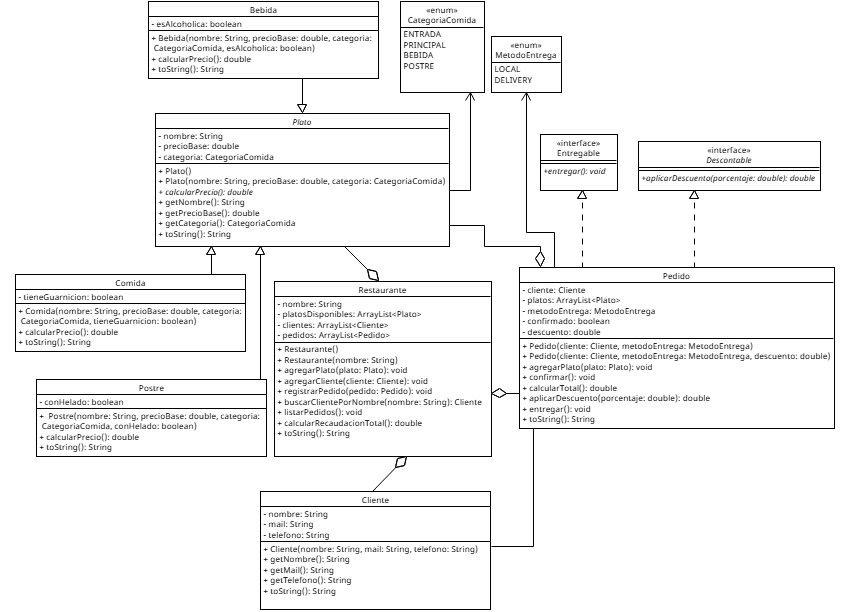

# Sistema de Gestión de Restaurante - Sabores del Sur

Proyecto en Java desarrollado en NetBeans que aplica los conceptos de POO (Herencia, Clases Abstractas e Interfaces).

## Diagrama UML del Proyecto

